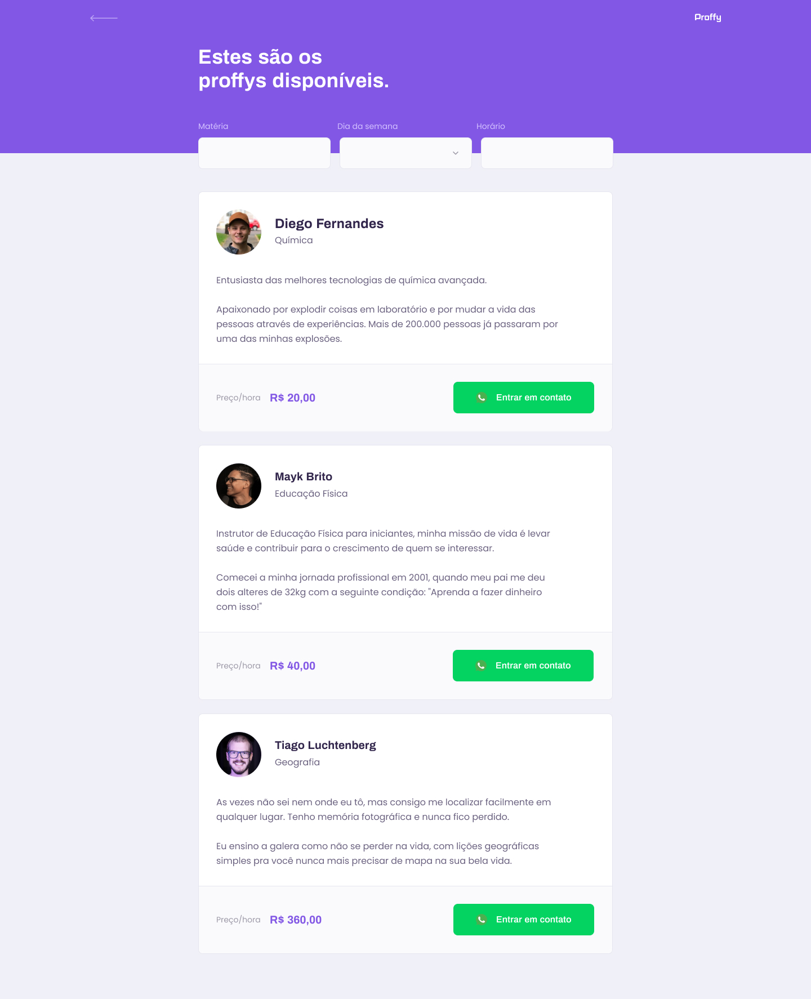
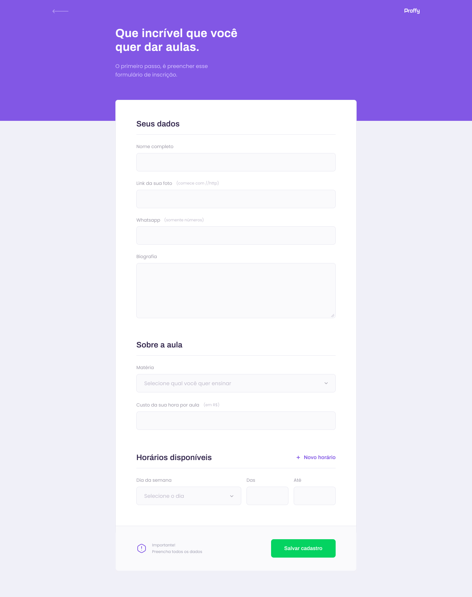

# Proffy

### Sobre
Projeto desenvolvido durante o bootcamp da [**Rockseat**](https://rocketseat.com.br/). 
Neste projeto desenvolvemos durante cinco dias juntos aos professores a interface <b>Proffy</b>, que seria uma plataforma para professores e alunos. Foram desenvolvidos poucas telas de como a **Home**, **Cadastro** e **Listagem de professores**. Neste projeto utilizei HTML, CSS e Javascript.

#### Minhas modificações

Estou fazendo algumas modificações CSS colocando comentário, separei algumas partes do código em sessões e alguns detalhes que se encaixam melhor no meu método de trabalho como troca de ids por classes, mas não modifiquei o HTML. O projeto é todo responsivo funcionando tanto no mobile como no desktop.

No momento estou finalizando projeto e pretendo passar o CSS para SASS e modificar cores e fontes.

#### Imgens do projeto

Imagem da tela inicial da plataforma construída.

Tela de professores

Tela do formulário de cadastro

